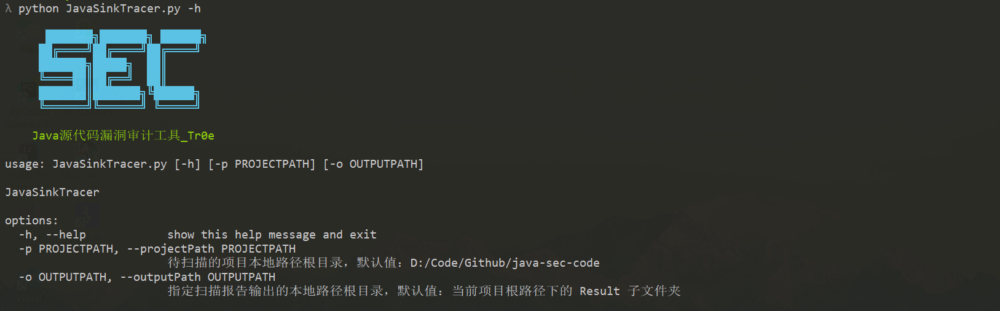
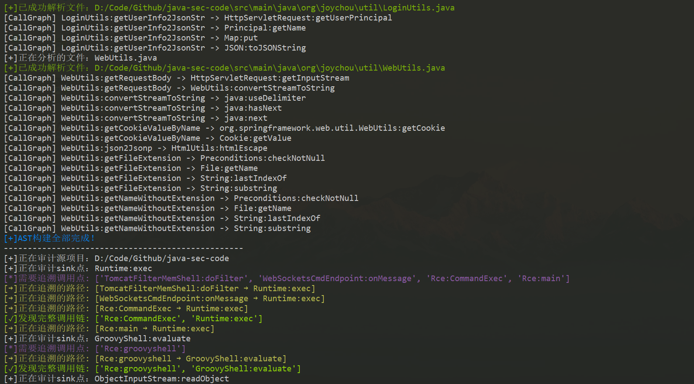
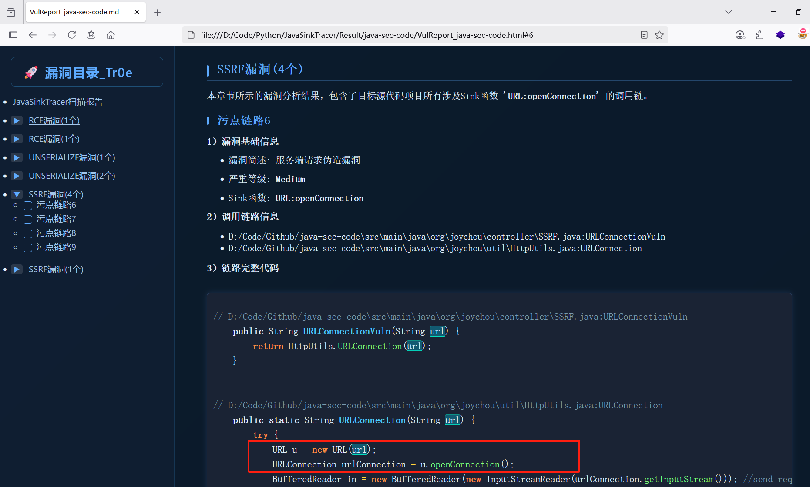

## 前言

JavaSinkTracer 是基于 Python javalang 库开发的一款轻量级 Java 源代码漏洞审计工具，开发人员 [Tr0e](https://github.com/Tr0e)。
> JavaSinkTracer is a lightweight Java source code vulnerability auditing tool developed based on the Python javalang library, developed by [Tr0e](https://github.com/Tr0e).

## 原理

常见的 SAST 工具（比如著名的 CodeQL）一般都是基于“变量级”的污点分析，即追踪从 Source 到 Sink 的调用路径上，外部可控的变量是否可达、以及是否经过净化，从而判定是否存在漏洞。 但是“变量级”的污点分析存在缺陷：对于线程调用、监听回调、反射调用、动态加载等场景，SAST 分析过程容易出现“断链”问题，从而导致漏报。

此工具基于“函数级”的污点分析，即反向追溯从 Sink（漏洞函数）到 Source（外部API函数）的调用链，暂不关注污点变量，只关注函数调用关系，可有效规避上述“变量级”污点跟踪的缺陷。

但是此工具也存在缺陷：“函数级”的污点追踪决定了提取到的“污点链路”中，不可避免地会存在部分外不可控的变量并无法有效传递到Sink点，从而导致误报。不过这个缺陷可以依靠当前火热的 AI 技术能力来有效解决（**Todo**）。

## 功能

此工具当前已实现的功能有：
- 可在 Sink 配置文件中，自由拓展待检测的漏洞危险函数；
- 自动构建 Java 源代码中所有函数的互相调用关系图call graph；
- 从 Sink 点反向追溯到 Source 函数（可从配置文件的“depth”自定义追溯深度），提取调用链；
- 程序自动识别“污点传播链路”上“不包含任何参数”的函数，排除不可能存在外部可控变量的链路；
- 借助 Python javalang 三方库，自动提取每条“函数级污点链路”上所有函数的源代码，方便分析审计；
- 自动生成漏洞报告（Md和html两种格式），Html报告支持漏洞栏目导航、漏洞代码高亮、代码变量跟踪等；

## 用法

基础环境：
```shell
pip install -r requirements.txt
```
运行命令：
```shell
python JavaSinkTracer.py [-h] [-p PROJECTPATH] [-o OUTPUTPATH]
```
完整参数：
```powershell
λ python JavaSinkTracer.py -h

      ███████╗███████╗ ██████╗
     ██╔════╝██╔════╝██╔════╝
     ███████╗█████╗  ██║
     ╚════██║██╔══╝  ██║
     ███████║███████╗╚██████╗
     ╚══════╝╚══════╝ ╚═════╝

    Java源代码漏洞审计工具_Tr0e

usage: JavaSinkTracer.py [-h] [-p PROJECTPATH] [-o OUTPUTPATH]

JavaSinkTracer

options:
  -h, --help            show this help message and exit
  -p PROJECTPATH, --projectPath PROJECTPATH
                        待扫描的项目本地路径根目录，默认值：D:/Code/Github/java-sec-code
  -o OUTPUTPATH, --outputPath OUTPUTPATH
                        指定扫描报告输出的本地路径根目录，默认值：当前项目根路径下的 Result 子文件夹
```

## 效果

以主流的开源 Java 漏洞靶场 [java-sec-code](https://github.com/JoyChou93/java-sec-code) 为例，扫描过程和漏洞报告效果如下：


漏洞的报告展示，以其中一个涉及到跨文件 SSRF 漏洞链路为例：

>【注意】工具扫描出来的漏洞数量，受Sink点配置文件的影响。上述扫描过程我仅配置了简单的RCE、反序列化、SSRF漏洞Sink点的扫描结果，故并未覆盖此靶场的全量漏洞。

## Todo

以下功能留给读者自行拓展完善：
- 添加更多漏洞危险函数规则；
- 借助 AI 分析提取的污点链路代码；
- 精准化提取污点链路上的函数（当前并未考虑Java多态）；

此工具尚未经大量项目实践，可能存在诸多考虑不周导致的缺陷，欢迎反馈和共同改进。
